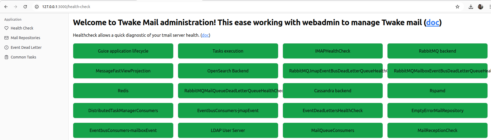

> Why do programmers prefer dark mode? Because light attracts bugs!

# Twake Mail Admin

Welcome to Twake Mail Administration (version `0.0.0`)

This project is a simple frontend for Twake Mail system operators. It enables quick and
timely verification of running systems and if need be ease remediations. Hopefully,
with this tool, regular operators will no longer need to cope with
[WebAmin REST interface](https://james.staged.apache.org/james-project/3.9.0/servers/distributed/operate/webadmin.html)
via CLI.

[This document](specs/poc-tmail-admin.pdf) summarizes feature included in Twake Mail admin
interface MVP.



**Non goals:** This project is not meant for doing:

- functional administration. Use **LinID** instead.
- presenting log and metrics. Use **Loki/Prometheus/Grafana** instead.

## Run it!

### Prerequisite

- Install [NVM](https://github.com/nvm-sh/nvm?tab=readme-ov-file#installing-and-updating)
  for managing local node versions.
- Install [bun](https://bun.sh/docs/installation) for compiling.

### Environment Variables

Before running the project, create a `.env` file based on `.env.example`:

```sh
cp .env.example .env
```

Then, update the values as needed.

| Variable          | Description                                      | Default Value               |
|------------------|------------------------------------------------|-----------------------------|
| `VITE_API_BASE_URL` | The base URL for the admin API.                     | `http://localhost:8000`     |
| `VITE_PAGE_LIMIT`  | Defines the number of items per page in pagination. | `20`                         |


### Commands

Then use node version 18:

```
nvm install 18
nvm use 18
```

Rename `.env.sample` into `.env` and edit the file accordingly to your Twake Mail environment.

Install other project dependencies:

```
bun install
```

Then run the dev version of the project:

```
bun run dev
```

### Run with Docker Compose

Alternatively, you can run the project using **Docker Compose**.

1. Ensure you have [Docker](https://docs.docker.com/get-docker/) and [Docker Compose](https://docs.docker.com/compose/install/) installed.
2. Run the following command to start the service:

   ```sh
   docker compose up --build
   ```

   This will build and start the application in a container.

3. To stop the containers, use:

   ```sh
   docker compose down
   ```

4. If you want to run the service in detached mode:

   ```sh
   docker compose up -d
   ```

### Dependencies

This project is built with [Vite](https://vitejs.dev/)!
