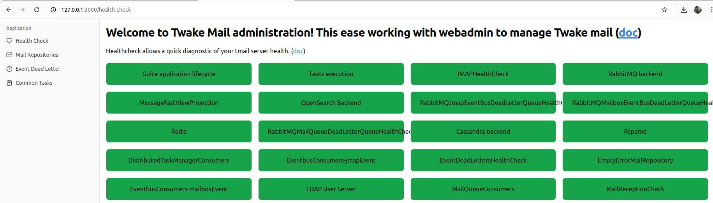

# Twake Mail Admin

Welcome to Twake Mail Administration (version `0.0.0`)

This project is a simple frontend for Twake Mail system operators. It enables quick and
timely verification of running systems and if need be ease remediations. Hopefully,
with this tool, regular operators will no longer need to cope with
[WebAmin REST interface](https://james.staged.apache.org/james-project/3.9.0/servers/distributed/operate/webadmin.html)
via CLI.

[This document](specs/poc-tmail-admin.pdf) summarizes feature included in Twake Mail admin
interface MVP.



**Non goals:** This project is not meant for doing:

- functional administration. Use **LinID** instead.
- presenting log and metrics. Use **Loki/Prometheus/Grafana** instead.

## Run it!

### Prerequisite

- Install [NVM](https://github.com/nvm-sh/nvm?tab=readme-ov-file#installing-and-updating)
  for managing local node versions.
- Install [bun](https://bun.sh/docs/installation) for compiling.

### Environment Variables

Before running the project, create a `.env` file based on `.env.example`:

```sh
cp .env.example .env
```

Then, update the values as needed.

| Variable          | Description                                      | Default Value               |
|------------------|------------------------------------------------|-----------------------------|
| `VITE_API_BASE_URL` | The base URL for the admin API.                     | `http://localhost:8000`     |
| `VITE_PAGE_LIMIT`  | Defines the number of items per page in pagination. | `20`                         |


### Commands

Then use node version 18:

```
nvm install 18
nvm use 18
```

Rename `.env.sample` into `.env` and edit the file accordingly to your Twake Mail environment.

Install other project dependencies:

```
bun install
```

Then run the dev version of the project:

```
bun run dev
```

### Run with Docker Compose

Alternatively, you can run the project using **Docker Compose**.

1. Ensure you have [Docker](https://docs.docker.com/get-docker/) and [Docker Compose](https://docs.docker.com/compose/install/) installed.
2. Run the following command to start the service:

   ```sh
   docker compose up --build
   ```

   This will build and start the application in a container.

3. To stop the containers, use:

   ```sh
   docker compose down
   ```

4. If you want to run the service in detached mode:

   ```sh
   docker compose up -d
   ```

### Dependencies

This project is built with [Vite](https://vitejs.dev/)!

## Profile editor

What this frontend shows depends entirely on the `allowed.urls` profile
configured for the operator's OIDC client in
[webadmin-proxy](https://github.com/linagora/webadmin-proxy). Writing one by hand
means knowing the WebAdmin API endpoint by endpoint.

[`profile-editor/`](profile-editor/README.md) generates one by asking questions —
which pages, which sections, which actions — and writes a rule file the proxy can
`include` as-is. It also runs backwards: `--check` takes an existing profile and
reports, page by page, what it makes visible.

From this checkout — standard library only, nothing to install, arrow keys and
checkboxes included:

```sh
cd profile-editor
python3 -m twake_profile_editor --name domain-support        # ask, then generate
python3 -m twake_profile_editor --name domain-support --fr   # ...in French
python3 -m twake_profile_editor --check domain-support.json  # what does it show?
```

Or from the image published alongside this one, **at the tag matching the
deployment you are writing the profile for** — the endpoint inventory is baked in,
so the tag is the version pin:

```sh
docker run --rm -it -v "$PWD:/work" --user "$(id -u):$(id -g)" \
    linagora/twake-mail-admin-profile-editor:1.2.3 --name domain-support --fr
```

It reads [`validation.md`](validation.md), `src/lib/proxy-resolver.ts` and every
`useIsAllowed` call site straight out of this repository, and its test suite
fails when they disagree — which is why it lives here rather than in a repository
of its own. See [`profile-editor/UPSTREAM.md`](profile-editor/UPSTREAM.md).
